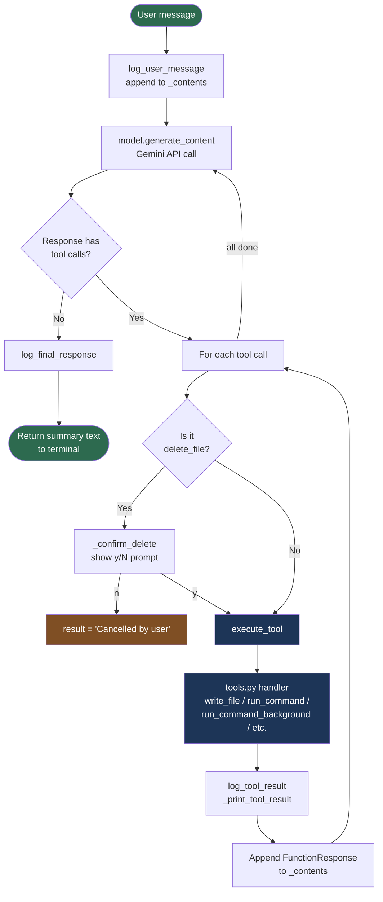

# Vibecoder

A fully autonomous AI coding agent for your terminal, powered by Google Gemini. Describe what you want built — Vibecoder writes the files, runs them, fixes errors, and keeps iterating until the task is completely done. Just like Cursor's Agent mode, but in your command line.

---

## Features

- **Fully agentic** — never stops mid-task; iterates write → run → fix until the code works
- **Persistent chat** — conversation context is maintained across messages in the same session
- **Live progress** — see every tool call (file writes, commands, searches) as it happens
- **Background processes** — servers and long-running commands run detached; session keeps going
- **Delete protection** — prompts `y/N` before any file is deleted
- **Full session logs** — every LLM exchange, tool input/output, and system prompt written to `~/.vibecoder/logs/`

---

## Setup

**1. Install dependencies**

```bash
pip install -r requirements.txt
```

**2. Get a Gemini API key** from [Google AI Studio](https://aistudio.google.com/apikey)

**3. Set the API key**

```bash
# Option A — environment variable
export GEMINI_API_KEY=your_api_key_here

# Option B — .env file (copy from .env.example)
echo "GEMINI_API_KEY=your_api_key_here" > .env
```

---

## Usage

### Interactive chat mode (recommended)

```bash
python -m vibecoder
```

The session stays open. Press **Enter twice** to submit a message. Type `exit` or press **Ctrl-C** to quit.

```
Vibecoder — AI Coding Assistant
Model     : gemini-2.0-flash
Workspace : C:\Projects\myapp
Submit    : press Enter twice
Quit      : type 'exit' or press Ctrl-C
Log       : C:\Users\you\.vibecoder\logs\session_20260316_103045.log

> Build a REST API with Flask that has /health and /users endpoints.
>

  [Writing] app.py
  [Writing] requirements.txt
  [Running] pip install flask
    | Successfully installed flask-3.1.0
  [Running] python app.py &
  [Background] python app.py
    | Process started in background (PID 18432).
    | Initial output:
    |  * Running on http://127.0.0.1:5000

────────────────────────────────────────────────────────────
Created app.py with /health and /users endpoints. Flask is running in background on port 5000.
────────────────────────────────────────────────────────────

> Now add input validation to the /users POST endpoint.
>
```

### Single-shot mode

```bash
python -m vibecoder "Create a Python script that fetches weather from Open-Meteo API"
```

### Custom workspace

```bash
python -m vibecoder --workspace ./my-project "Add unit tests for the auth module"
```

### Pass API key directly

```bash
python -m vibecoder --api-key AIza...
```

---

## Session Logs

Every session is logged to `~/.vibecoder/logs/session_YYYYMMDD_HHMMSS.log`. The log captures everything:

- System prompt
- Each user message
- Every LLM response (text + tool calls)
- Every tool input and output
- Final responses
- Errors and timing

You can watch it live while a session runs:

```bash
# Linux / macOS
tail -f ~/.vibecoder/logs/session_*.log

# Windows PowerShell
Get-Content "$env:USERPROFILE\.vibecoder\logs\session_*.log" -Wait
```

---

## Available Tools

All file operations are **sandboxed to the workspace directory** — the model cannot read or write outside it.

| Category | Tool | Description |
|---|---|---|
| **Write** | `write_file` | Create or overwrite a file |
| | `search_replace` | Find & replace in a file (plain text or regex) |
| **Read** | `read_file` | Read entire file |
| | `read_file_lines` | Read a line range (1-based) |
| **Execute** | `run_command` | Run a command that exits on its own — killed after **15 s** |
| | `run_command_background` | Start a server/service — detaches after **5 s**, returns PID |
| **Search** | `grep` | Regex search with optional context lines |
| | `search` | Plain-text search, optional glob filename filter |
| | `find_files` | Glob-based file discovery |
| **Manage** | `list_directory` | List a directory |
| | `create_directory` | Create directory tree |
| | `delete_file` | Delete a file *(requires user y/N confirmation)* |
| | `move_file` | Move or rename a file |
| | `file_exists` | Check existence |
| | `count_lines` | Line count with optional code/blank/comment breakdown |

---

## Code Flow

### Module architecture

```
python -m vibecoder
        │
        ▼
  __main__.py          suppress warnings, then call main()
        │
        ▼
   main.py             parse CLI args
        │
   ┌────┴────────────────────────────┐
   │ single-shot                     │ interactive REPL
   │ run() wrapper                   │ _collect_input() loop
   └────────────┬────────────────────┘
                │
                ▼
          loop.py · Session
                │
        ┌───────┴───────────┐
        │                   │
   client.py           logger.py
   get_model()         SessionLogger
   execute_tool()      (one log file
        │               per session)
        ▼
   tools.py
   get_tool_handlers()
   (all implementations)
```

### Agentic loop (Session.send)



### File structure

```
vibecoder/
├── vibecoder/
│   ├── __main__.py     Entry point — suppresses warnings, calls main()
│   ├── main.py         CLI args, REPL loop, _collect_input()
│   ├── loop.py         Session class, agentic tool-call loop, SYSTEM_PROMPT
│   ├── client.py       Gemini model setup, tool declarations, execute_tool()
│   ├── tools.py        All tool implementations (sandboxed to workspace)
│   ├── logger.py       SessionLogger — writes ~/.vibecoder/logs/*.log
│   └── __init__.py     Version
├── requirements.txt
├── .env.example
└── README.md
```

---

## Configuration

| Environment variable | Description |
|---|---|
| `GEMINI_API_KEY` | Your Gemini API key (required) |

| CLI flag | Default | Description |
|---|---|---|
| `--workspace` / `-w` | current directory | Directory for all file operations |
| `--api-key` | `$GEMINI_API_KEY` | Override the API key |

---

## Requirements

- Python 3.10+
- `google-generativeai >= 0.8.0`
- `python-dotenv >= 1.0.0`
